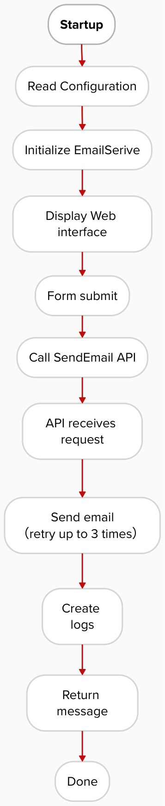
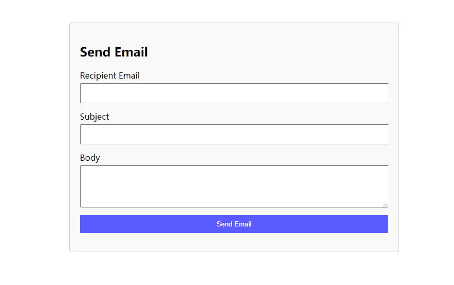
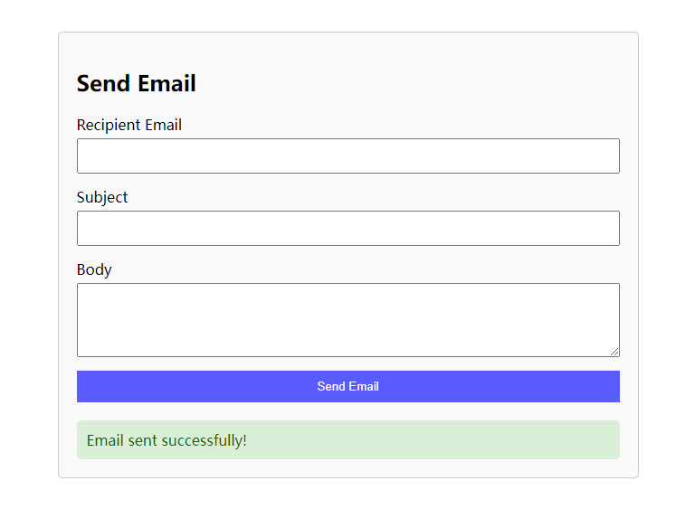
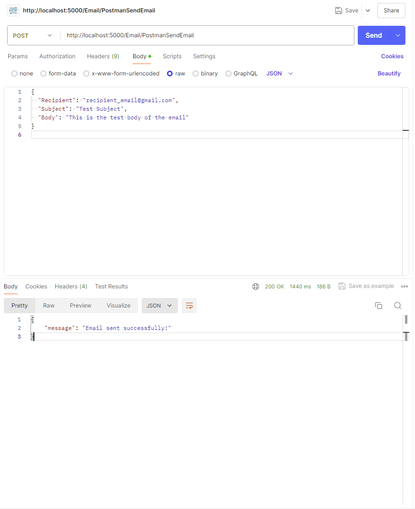

# EmailAssignment

A simple application to enable users to send email to customer.

## Requests
  - [x] Code should be written in C#.
  - [x] Send Email Method should be in a dll that can be reused throughout different applications and entry
    points.
  - [x] Email sender, recipient, subject, and body (not attachments), and date must be logged/stored indefinitely
    with status of send attempt.
  - [x] If email fails to send it should either be retried until success or a max of 3 times whichever comes first,
    and can be sent in succession or over a period of time.
  - [x] Please store all credentials in an appsettings instead of hardcoded.
  - [x] At minimum that method/dll should be called from a console application.
  - [x] Extra Credit if attached to an API that can be called from Postman.
  - [x] EXTRA Credit if a front end (wpf/asp.net web application/etc...) calls the API to send the email.
  - [x] In any scenario you should be able to take in an input of a recipient email to send a test email.

## Project flowchart


## Requirements

  - .Net 8.0.7 [[Download]](https://dotnet.microsoft.com/en-us/download/dotnet/8.0)


## Installation

1. Git clone this repository
2. Run `dotnet restore`
3. Run `dotnet build` to build the project

## Configuration

Before running the application, you need to configure SMTP settings in the `appsettings.json`
##### Since the application sends email based on TLS portal, so please use your google app password
[How to create your google app password](https://support.google.com/accounts/answer/185833?hl=en)
```
{
  "EmailSettings": {
    "SmtpServer": "smtp.gmail.com",
    "Port": 587,
    "Username": "your_email@gmail.com",
    "Password": "your_email_app_password",
    "EnableSsl": true,
    "FromEmail": "your_email@gmail.com"
  }
}
```

##  How to Run

### Run `WebApp`
To run the web application, use the following command:
```
dotnet run --launch-profile "WebApp"
```

Then EmailSenderApi is available  through [http://localhost:5000/Email](http://localhost:5000/Email)



##  How to Test

### WebApp

1. Input required Recipient Email, Subject and Body
2. Click on 'Send Email' to send a `POST` request to `http://localhost:5000/Email/SendEmail`
3. Display notification `Email sent successfully!` and create a `sentlog` when email sent 
4. Display nothing when email fails to send, but create a `faillog`
5. Check current project path `Log` folder to see if there are any logs 
6. Check the recipient's mailbox


### Postman test

1. Open Postman 
2. Create a new `POST` request, url is `http://localhost:5000/Email/PostmanSendEmail`
3. Set the header `Content-Type` to `application/json`
4. Enter the following JSON data in Body
```
{
  "Recipient": "recipient_email@example.com",
  "Subject": "Test Subject",
  "Body": "This is the test body of the email"
}
```
5. Send the request and check the response.


### Retry mechanism
When the email fails to be sent, the application will retry sending, up to 3 times with an interval of 2 seconds between each sending attempt. You can see there will be 3 `faillog` created under `Log` folder.

#### test by:
    1. Provides incorrect SMTP configuration.
    2. Use Postman to send the request and observe whether the retry mechanism takes effect.
